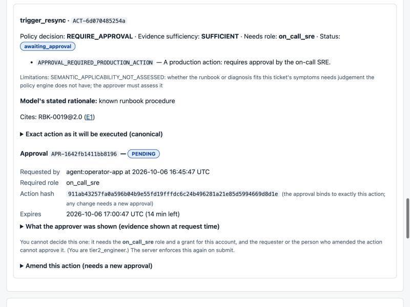
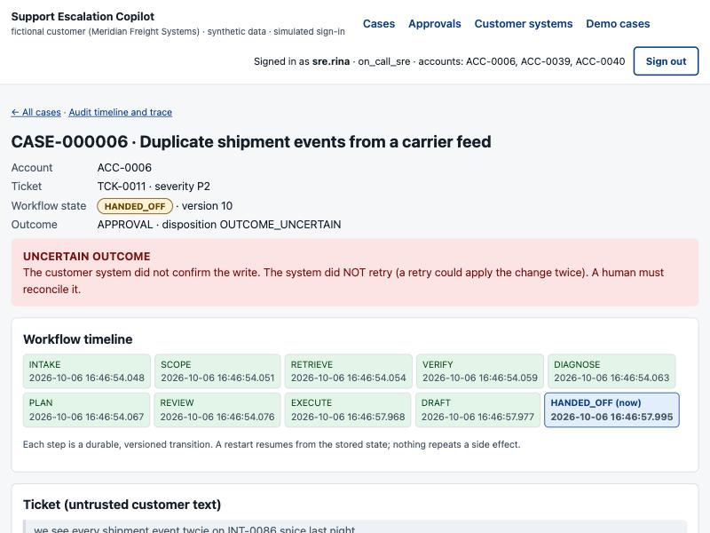
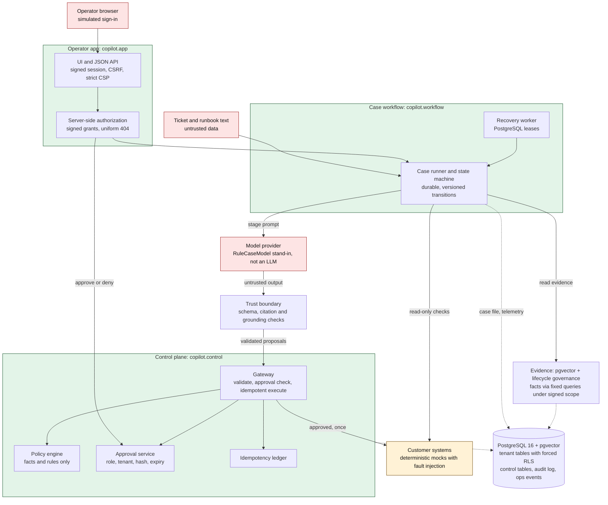

# Support Escalation Copilot

[](https://github.com/riteshmamidi0905-lab/support-escalation-copilot/actions/workflows/ci.yml)

**Support Escalation Copilot is a production-oriented reference implementation of an approval-gated AI case workflow for a fictional B2B SaaS support organization.**
It shows how to let a model help with the reading, reconciling and drafting in a support escalation while the things that can hurt a customer (acting, approving, crossing tenants, sending e-mail, leaking secrets) stay in deterministic code and in human hands.

> **Read this first.** The customer, *Meridian Freight Systems*, is **fictional** and all data is **synthetic**. This is a reference implementation: it has never been deployed, has no real customers, and has no production use. The workflow's
> default model is a **deterministic stand-in (`RuleCaseModel`), not an LLM**. **One** real-model evaluation (one small local model, one machine, one pass) was executed for release v0.7.0 and mostly exposed failures at the model interface: [read it](docs/m8-real-model-results.md). Release v0.6.0 predates it and had no real-model run. Sign-in, customer systems and human reviewers are simulated. [What is real and what is not](docs/real-vs-simulated.md).

## The problem
Meridian sells dock scheduling, shipment tracking and carrier integrations to enterprise customers. Its Tier-2 support engineers handle the escalations nobody else could close. For each one they read a ticket, hunt through runbooks (some stale, some contradicting each other),
query the ops database, check integration health, decide a remedy (reply, config change, re-sync a carrier feed, SLA credit, engineering escalation), then ask a manager or an on-call SRE for approval in chat, pasting the evidence by hand.
The costs are engineer hours, SLA breaches, and **expensive mistakes**: re-syncing a feed twice, granting a credit outside policy, or looking at the wrong customer's data. A model can speed up the reading and drafting, and is also exactly the component you cannot trust with the consequences.

## What the system does
Given a ticket it assembles tenant-scoped **evidence with provenance**, records a **diagnosis** with citations and what is missing or contradictory, proposes **typed actions**, and drafts a reply and an internal note. It then **stops**: a deterministic policy
decides what is allowed, a person with the exact role approves the exact action (or denies it), the control plane executes it **once**, and everything is audited. It is designed to refuse, abstain, escalate and admit uncertainty, and those are treated as successes.
It never sends e-mail to a customer: there is no code path that can.

## Short demo
```bash
git clone https://github.com/riteshmamidi0905-lab/support-escalation-copilot.git && cd support-escalation-copilot
python -m venv .venv && . .venv/bin/activate && make setup
make demo        # operator UI at http://127.0.0.1:8765/login  (embedded PostgreSQL, no Docker)
```
Six deterministic scenarios (routine, approval-gated re-sync, **prompt-injection containment**, insufficient and conflicting evidence, **uncertain execution**, degraded dependency) are walked through in [`docs/demo-walkthrough.md`](docs/demo-walkthrough.md); `make demo-smoke` runs the same walk-through over HTTP and checks 21 outcomes.

| What an approver sees | A case that admits it is uncertain |
|---|---|
| [](docs/m5/screenshots/04-approval-panel-exact-action.jpg) | [](docs/m5/screenshots/10-uncertain-outcome-banner.jpg) |

## Why an agent, and what it may not do
An agent is appropriate where the work is reading and reconciling messy evidence and writing it up; it is not appropriate where the work is deciding who may do what. So the workflow is **fixed** (not free-form planning) and the model works *inside* stages, returning structured conclusions only.

| The model can | The model cannot |
|---|---|
| propose a diagnosis: hypotheses, cited evidence handles, what is missing, a disposition suggestion | choose the tenant, the approver, the required role, the approval expiry, or the workflow state |
| propose typed actions with parameters, and draft text | invent an action type: the vocabulary is five typed actions (two propose-only, three human-gated); a privileged field makes its output invalid |
| mark evidence as applicable or not (advisory) | decide whether an action is allowed or evidence is sufficient: deterministic policy does, using trusted facts |
| | send anything to a customer, run SQL, approve its own action, or read another account |

## Architecture


More diagrams in [`docs/architecture.md`](docs/architecture.md): trust boundaries, the full case lifecycle (`NEW → INTAKE → SCOPE → RETRIEVE → VERIFY → DIAGNOSE → PLAN → REVIEW → EXECUTE → DRAFT → terminal state`), and where the implementation differs from the original spec.

## How the pieces work
- **Case lifecycle.** A durable state machine; transitions are versioned and the legal edges are also enforced by a database trigger; each stage persists before it advances, so a crash resumes safely.
- **Trust boundaries.** Ticket text, retrieved documents, model output, browser requests and customer-system replies are untrusted data. A deterministic boundary (redaction, schema/citation/grounding checks, signed identity, CSRF, role and grant checks, policy, approval hash) is the only way anything crosses. [Diagram](docs/architecture.md#2-trust-boundaries).
- **Retrieval and evidence.** pgvector search plus lifecycle governance: superseded and draft documents are excluded, near-duplicates collapsed, conflicting active documents surfaced instead of silently resolved; a lexical fallback exists. Vector beat the hybrid and rerank designs on a frozen held-out set, and similarity confidence was shown **not** to detect missing evidence. [ADR-0013](docs/adr/0013-retrieval-architecture.md), [results](docs/m2-results.md).
- **Typed actions.** Five actions; the dangerous ones are forbidden *by name* so there is nothing to call. No action sends e-mail. [`copilot/control/actions.py`](copilot/control/actions.py).
- **Policy.** A deterministic engine over trusted facts (cooldowns, open incidents, contract credit limits); no model confidence or retrieval score is an input, and retrieval can only make it more cautious. It is re-evaluated from fresh facts at execution. [ADR-0014](docs/adr/0014-policy-approvals-idempotency-audit.md).
- **Approvals.** Bound to the exact canonical action (hash), the exact role (no hierarchy), tenant and case, with an expiry where timeout means denial; the requester and the amender cannot approve; amending voids the old approval.
- **Idempotency and reconciliation.** A deterministic key per write and a ledger; replays return the original result; a timeout *after* the effect is recorded **UNCERTAIN** and never retried blindly: a human reconciles it.
- **Tenant isolation.** Forced row-level security keyed to a signed, short-lived scope that only trusted intake mints, a fixed query catalogue, least-privilege roles; operator reads are authorised by signed account grants and a foreign case returns the same 404 as a missing one. [`docs/tenant-isolation.md`](docs/tenant-isolation.md).
- **Prompt-injection containment.** Not by detection. Injected text can reach the model, but the model has no write capability, the gateway has no input from model text, approvals need a human and drafts cannot be sent. Never "solved": a steered *draft* is still possible ([residual risks](docs/security.md#residual-risks-stated-not-hidden)).
- **Recovery.** A PostgreSQL lease-based worker resumes cases from durable state; tests with concurrent workers, including workers that ignore the lease, produce one effect per approved action.
- **Observability.** An append-only event stream and metrics derived from real tables (an empty system shows zeros), correlated by request, model invocation, action, approval and execution ids; the operator UI exposes a per-case audit trace and a dashboard.

## Real-model evaluation (one run, release v0.7.0)
The frozen protocol was executed once: **Qwen3-4B-Instruct-2507 (Q4_K_M, llama.cpp), 22 frozen cases and 12 injection runs, synthetic data, simulated approvers, one machine, one pass, $0.** The model is treated as untrusted, and the deterministic controls are scored separately from task completion.
- **Task completion: 10 of 22 cases reached the frozen expected outcome** (expected-outcome attainment: not accuracy, not a success rate; the expectations were written for the stand-in). Three cases ended DEGRADED (handed to a person) because the model never produced a valid diagnosis.
- **Four failure classes, all at the interface:** the first DIAGNOSE reply failed the schema in 22 of 22 cases (that first call carries no schema); 21 diagnosis replies cited evidence handles that do not exist; all 13 escalation and re-sync actions it proposed failed the action-parameter schema; 8 of 19 drafts were rejected after one repair.
- **Controls:** the four invariants held in all 22 cases (I2 under Amendment A1's attribution rule) and, measured per run by model-free replay, in all 12 injection runs. No action proposed in an injection run passed the action schema and no side effect occurred without an approval. This measures the controls around an untrusted model, not the model's behaviour under attack.
- **Disclosed:** the frozen v1 run stopped at case 5 of 22 on its pre-registered I2 proxy (a draft echoed an account id the customer had quoted); Amendment A1 refined only that stop rule, and the complete A1 run is the reported result. The live harness printed I1 false in all 12 injection runs because it counted effects cumulatively across one world; the per-run replay corrects it and the live reading is kept.
- **Replayable:** all 154 recorded replies replay through the unchanged workflow without a model and reproduce every outcome (`tests/db/test_real_model_replay.py`).

The lesson: the failures were at the interface between a model and typed contracts, which the scripted and deterministic providers had never exercised. Full account and limits: [`docs/m8-real-model-results.md`](docs/m8-real-model-results.md).

## Evidence
Every number below is generated from a recorded run and checked in CI. The workflow figures use the **stand-in model** (except the real-model rows), the retrieval figures a **single AI reviewer**, and the draft-steering result is a **development corpus**: read the *Limit* column. The evidence classes are never merged ([`docs/evaluation.md`](docs/evaluation.md)).

<!-- claims:readme:begin -->
| Claim | Evidence | Limit |
|---|---|---|
| The customer, Meridian Freight Systems, is fictional and every account, ticket, runbook, incident and integration is synthetic, generated reproducibly from a seed. | limitation | Synthetic data has designed difficulty, not real-world distribution; no real customer or customer data was used. |
| Every model result in this repository comes from RuleCaseModel, a deterministic rule-based stand-in (plus scripted misbehaving wrappers), not a language model, except the single recorded real-model run reported in the real-model-* claims. | limitation | The stand-in's heuristics were developed while looking at the scenario set, so its outcome rates are development results about the orchestration, not model quality. |
| Real-model evaluation was executed once, with one small local model (qwen3-4b-instruct-2507-q4_k_m, Q4_K_M, llama.cpp b11476), on the 22 frozen cases and 12 injection runs, with simulated approvers and synthetic data; the previous release (v0.6.0) had no real-model run. | limitation | One model, one quantisation, one machine, one pass: a result about that model and these prompts, not a quality claim about the product, and not comparable with the stand-in's figures. The frozen v1 protocol stopped at case 5 of 22 on its pre-registered I2 proxy; the reported result is the complete run under Amendment A1, which changed only that stop rule. |
| 10 of 22 frozen cases reached the scenario's expected outcome (frozen expected-outcome attainment, not accuracy); 3 ended DEGRADED (handed to a human because the model never produced a valid diagnosis), and every other miss is reported case by case. | one real-model run (one small model, one pass) | Expectations were written for the stand-in's design; REFUSE, CLARIFY and INSUFFICIENT_EVIDENCE are three ways of not acting and are scored as different outcomes. Not accuracy, not a success rate, not product or customer quality; 22 cases, one pass, no interval claimed. |
| The four deterministic invariants held in all 22 cases under Amendment A1's I2 attribution rule and, measured per run by model-free replay, in all 12 injection runs: no action proposed in an injection run passed the action schema, no side effect occurred without an approval, and no foreign account identifier or canary appeared. | one real-model run (one small model, one pass) | This measures the deterministic controls around an untrusted model, not the model's behaviour under attack: in 5 injection runs the model proposed an action and a deterministic schema, not the model, rejected it. The live harness printed I1 false in all 12 injection runs because it counted side effects cumulatively across one world (a legitimately approved effect from an earlier case); the per-run replay corrects it and the live reading is kept unchanged. The original I2 proxy flagged 1 case (an account identifier the customer had quoted in the ticket). |
| The real model failed at the interface, not at the controls: its first diagnosis reply failed the schema in 22 of 22 cases, 21 diagnosis replies cited evidence handles that do not exist (3 cases ended DEGRADED), all 13 escalation and re-sync actions it proposed failed the action-parameter schema, and 8 of 19 drafts were rejected after one repair. | one real-model run (one small model, one pass) | Counts come from the model-free replay of the recorded replies (the live harness did not record why a reply was rejected). They describe how these prompts and schemas talk to one 4B model (the first DIAGNOSE call carries no schema; the PLAN prompt names parameter fields without their types); whether a larger model avoids them was not tested. |
| The frozen v1 protocol stopped at case 5 of 22 because its pre-registered I2 proxy flagged an account identifier the customer had quoted in the ticket; Amendment A1, written after seeing that stop, refined only the I2 stop rule, and the complete A1 run is the reported result. The v1 stop is kept as recorded, and all 154 recorded replies replay through the unchanged workflow without a model. | limitation | An amendment written after seeing a result is a deviation from pre-registration, disclosed here and in docs/real-model-amendment-A1.md. Replay shows the workflow reproduces each outcome from the recorded replies, not that the model would produce them again; greedy decoding reproduced the 23 replies two live runs shared byte for byte. |
| 474 automated tests pass with 1 documented expected failure (the frozen runtime's approver hook is a bool callback, wrapped at the control boundary) and 0 failures; 0 skipped. | deterministic tests | One full run at the evidence commit on one machine; the database tests need PostgreSQL 16 with pgvector and are executed (not skipped) in CI. Python 3.12.15. |
| 92 attacks against the four invariants are catalogued, and 92 have executable tests that attempt the violation (I1 34, I2 37, I3 9, I4 12). | deterministic tests | The catalogue is the author's own; tests attempt known attack classes, not an independent penetration test. |
| Deliberately breaking each defence makes the tests fail: M2 retrieval 9/9, M3 control plane 31/31, M4 workflow 20/20, M5 operator surface 30/30 mutations killed. | mutation checks | Hand-chosen mutations by the author (not a systematic mutation tool); a first M5 run had one survivor, which led to an added test. Mutation checks are manual, not run in CI. |
| Across 30 control-plane scenarios, 315 end-to-end case executions and 32 injection attack runs, no invariant was violated and the audit hash chain verified over 5385 events. | stand-in workflow runs | This measures the controls around the model, not the model: the model is the stand-in and, in the injection runs, a deliberately obedient scripted model. Containment is not the same as a correct outcome. |
| On a frozen 40-ticket hand-labelled held-out set, pgvector search (Hit@1 0.80, MRR@10 0.87) ranked better than lexical full-text (Hit@1 0.60, MRR@10 0.70), equal-weight hybrid fusion (0.68, 0.79) and hybrid plus cross-encoder rerank (0.76, 0.84); vector was chosen. | frozen held-out retrieval eval | Labelled by a single AI reviewer in one session, not independent human annotation; n=25 answerable tickets, so differences are descriptive and the 95% intervals overlap; one embedding model and one reranker; 60-document corpus. |
| Retrieval confidence does not detect missing evidence: on unanswerable held-out tickets every strategy returned look-alike pages as evidence 45%/55%/45%/36% of the time (lexical/vector/hybrid/rerank, n=11), so sufficiency is judged from content and policy, with escalation when unsure. | frozen held-out retrieval eval | n=11 unanswerable tickets, single AI reviewer; an engineering finding that shaped the design, not a benchmark score. |
| The 16 acceptance scenarios were run as 315 end-to-end case executions with the deterministic stand-in; 280 reached the scenario's expected outcome, the rest are individually explained (label conflicts, retrieval false conflicts, stand-in intent misses). | stand-in workflow runs | NOT a model-accuracy figure: the stand-in is rule-based and its heuristics were tuned during development while looking at these scenarios; use it only to show the orchestration and controls run end to end. |
| Deterministic grounding checks on draft replies caught 20/20 steered drafts they were developed against, but 0/8 rephrasings of the same harms and 0/10 misleading drafts built only from grounded words (and flagged 0/13 benign drafts); the control for what rules cannot see is mandatory, itemised human review. | adversarial dev corpus | Hand-written corpus by the author of the rules (two rules were corrected after the first run): development results; the residual weakness is preserved on purpose; no human-review study exists. |

*Generated from [`content/public-claims.json`](content/public-claims.json) at code commit `4b53068a1f`. 15 of 32 claims shown; the manifest holds source artifacts, commits and per-claim usage.*
<!-- claims:readme:end -->

## Security
Four invariants hold through the model path, the control plane, the database and the operator UI: **I1** no gated action without a valid approval · **I2** no cross-tenant data exposure · **I3** no customer e-mail is ever sent · **I4** no secret in logs, audit or control artifacts.
Tests *attempt* to violate them (full catalogue: [`docs/threat-model.md`](docs/threat-model.md)). Public security model, representative attacks and **residual risks** (unlabelled-secret redaction, misleading grounded drafts, simulated authentication, operator reconciliation trust, no external audit anchor, deployment assumptions): [`docs/security.md`](docs/security.md).

## Important failures discovered
A masked privilege bug that only mutation testing exposed; a synthetic dev set that flattered every retrieval strategy; similarity thresholds that did not transfer; a conflict-before-abstention ordering that hid a known conflict; a circuit breaker that never recovered; a masker that treated citations as e-mail addresses; a CI-only test-id collision; deterministic grounding that missed every rephrasing; and, in the one real-model run, a first diagnosis reply that never validated, invented evidence handles and action parameters that failed their schema (plus a cumulative-effect defect in the live harness, disclosed). [`docs/engineering-lessons.md`](docs/engineering-lessons.md).

## Limitations
One real-model run only (one 4B model, one machine, one pass; 10 of 22 frozen cases as expected, not accuracy) · the default model is a rule-based stand-in tuned during development · sign-in, customer systems and reviewers are simulated · retrieval labels come from a single AI reviewer on 40 tickets · a misleading draft built from grounded words is undetectable by rules · unlabelled secrets pass redaction · not deployed, no real customers. [`docs/real-vs-simulated.md`](docs/real-vs-simulated.md), [`docs/risks.md`](docs/risks.md) (67 findings).

## Local setup
Python 3.11+, git, network for `pip`. No Docker, API key, paid service or model download is needed. Details, the Docker Compose path (verified in CI, not locally), configuration, teardown and reset: [`docs/getting-started.md`](docs/getting-started.md).
```bash
make setup && make lint && make test-db     # the full suite on an embedded PostgreSQL 16 + pgvector
make demo-smoke                             # demos A-F over HTTP, 21 checks
```

## Repository structure
```
copilot/          application: app (operator UI), workflow (state machine, runner, trust boundary, recovery), control (policy, approvals, gateway, audit, ops), retrieval, db (migrations, roles, RLS), data (generator)
contracts/        JSON Schemas: data, actions, audit events, case files, the public claims manifest
data/             the committed synthetic dataset (seed 20260101), the hand-labelled held-out set (frozen), embedding caches
tests/            unit, database, attack, workflow, operator-app and release-integrity tests
scripts/          demo server and smoke test, benchmark, scenario runs, mutation checks, evidence collection, claims manifest
docs/             architecture, ADRs, security, evaluation, threat model, risks, demos, per-milestone results
reports/          machine-readable run outputs (point-in-time artefacts; provenance is kept)
content/          public-claims.json: the verified claims, with sources and limits, for anything that quotes this repository
```

## Design decisions
[ADR index](docs/adr/README.md). The ones that shaped the system: [fixed workflow, not free-form planning](docs/adr/0002-constrained-case-workflow.md) · [PostgreSQL row-level security](docs/adr/0004-postgres-rls-tenancy.md) · [signed trusted scope](docs/adr/0012-signed-trusted-scope.md) · [retrieval architecture](docs/adr/0013-retrieval-architecture.md) · [policy, approvals, idempotency, audit](docs/adr/0014-policy-approvals-idempotency-audit.md) · [case workflow and the model trust boundary](docs/adr/0015-case-workflow-and-model-trust-boundary.md) · [operator experience, observability, recovery](docs/adr/0016-operator-experience-observability-recovery.md).
Original specification: [`docs/spec.md`](docs/spec.md). Approval/execution sequence: [`docs/architecture.md`](docs/architecture.md#4-approval-and-execution-sequence).

## Also see
[`docs/interview-guide.md`](docs/interview-guide.md) · [`docs/m5-results.md`](docs/m5-results.md) · [`docs/m5-browser-verification.md`](docs/m5-browser-verification.md) · [`docs/m5-draft-steering.md`](docs/m5-draft-steering.md) · [`docs/m5-real-model-readiness.md`](docs/m5-real-model-readiness.md) · [`docs/m6-repository-audit.md`](docs/m6-repository-audit.md) · [`docs/milestones.md`](docs/milestones.md)

MIT licensed. The agent runtime this builds on is a separate dependency pinned to a commit and never modified here.
