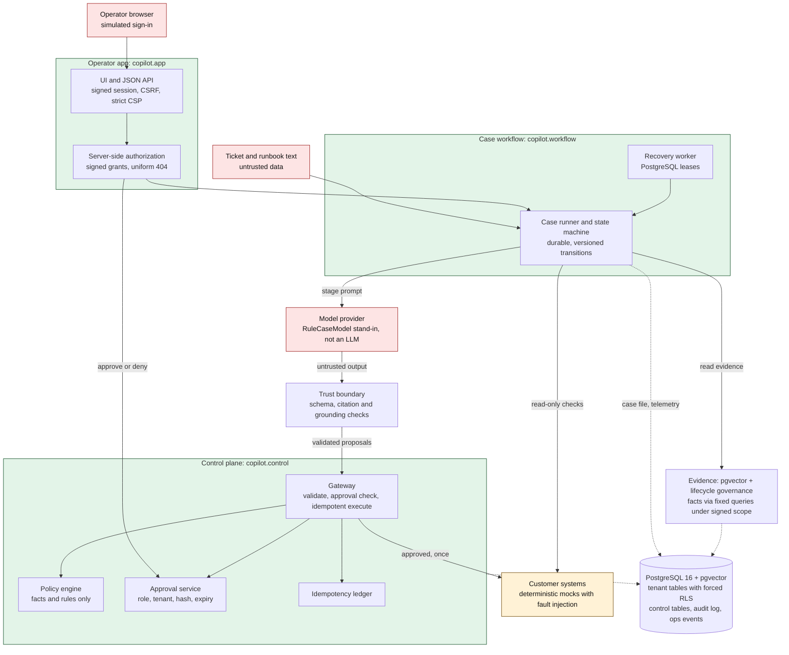
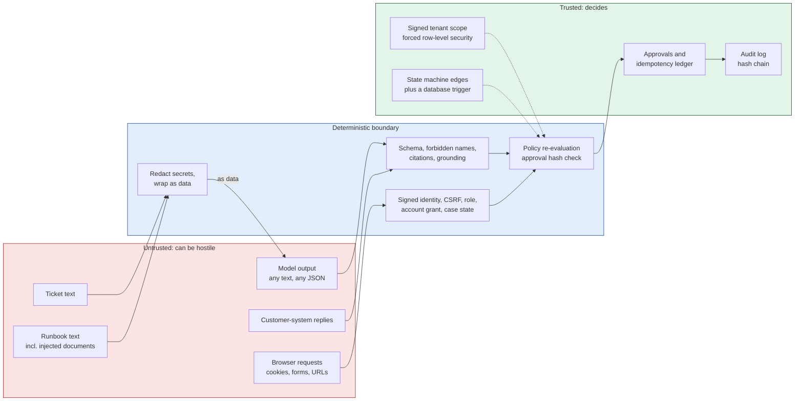
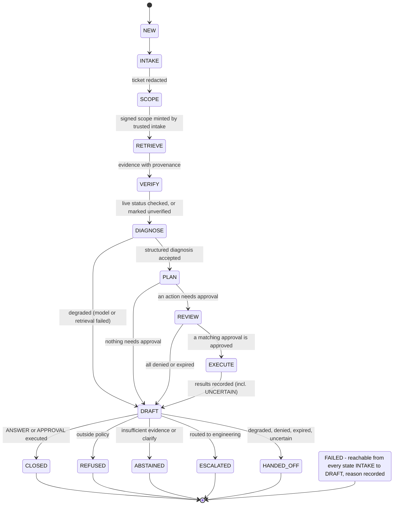
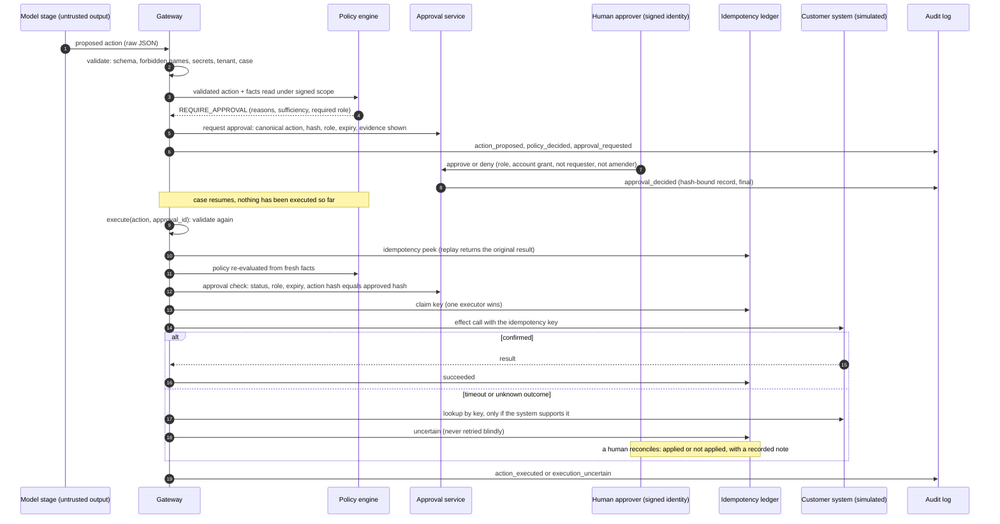

# Architecture

This is what exists in the repository, drawn from the code (module names are real). Everything marked *simulated* is a deterministic stand-in for something a real deployment would have; see
[`real-vs-simulated.md`](real-vs-simulated.md). The original design intent is in [`spec.md`](spec.md); where this implementation differs, the table at the end says so.

## 1. System architecture

An operator opens a case; a fixed workflow gathers evidence, asks the model for **structured conclusions only**, and hands every proposed action to a deterministic control plane. Humans approve; the
control plane executes once; everything lands in an audit log and in operational telemetry.

## 2. Trust boundaries

What each side may do, and the one thing that may cross. Nothing a model or a document says is ever an authority.

**Simulated, and therefore not evidence about the real thing:** the model (`RuleCaseModel`), the customer systems (mocks with fault injection), the identity provider (a persona picker) and the human reviewers (the author).

| Question | Answer in the code |
|---|---|
| What can the model control? | The *content* of a diagnosis (hypotheses, which evidence handles it cites, a disposition suggestion), proposed typed actions with parameters, and draft text. All of it is validated, and none of it is trusted. |
| What can it not control? | Tenant, role, approver, expiry, workflow state, the action vocabulary, whether an action is allowed, whether evidence is sufficient, whether anything is sent. A privileged field in its output makes the output invalid. |
| Where is a prompt injection stopped? | Not by detection (a regex flag is advisory). By architecture: the model has no tool that writes, the gateway has no input from model text, approvals need a human, and the draft cannot be sent. See [`security.md`](security.md). |

## 3. Case lifecycle

The edges are the *only* legal transitions; they are stored in the database and enforced by a trigger as well as in the application (A-I1-22). The model never names or sets a state.

A case waiting in `REVIEW` costs nothing: a recovery worker polls on a back-off and the approval decision wakes it. A restart resumes from the stored state; every stage persists its output before it advances.

## 4. Approval and execution sequence

A proposal is not an effect. Policy is evaluated twice (at proposal and again, from fresh facts, at execution); the approval is bound to the exact action by hash; the write carries an idempotency key; an
unknown outcome is never retried blindly.

## 5. Modules

| Module | Responsibility |
|---|---|
| `copilot.contracts`, `contracts/*.schema.json` | JSON Schemas for data, actions, audit events, case files, the public claims manifest; cross-record rules |
| `copilot.data` | seeded synthetic generator (40 accounts, 300 tickets, 60 runbooks, 119 integrations, 12 incidents) and design checks |
| `copilot.scope`, `copilot.db` | signed tenant scope; migrations, roles, forced RLS, scoped sessions, fixed query catalogue, trusted intake, loader |
| `copilot.retrieval` | chunking, FTS / vector / hybrid / rerank strategies, lifecycle and conflict governance, evaluation harness |
| `copilot.control` | actions, policy, approvals, identity, idempotency ledger, audit, gateway, mocks, access, ops events, metrics |
| `copilot.workflow` | state machine, runner, model I/O (structured output, repair, retries), trust boundary, grounding, recovery, providers |
| `copilot.app` | operator UI, operator actions (approve / amend / review / reconcile), demo entry points |
| `agent.*` (external, pinned) | the frozen agent runtime: provider abstraction, structured-output repair, retries, budgets, tracer. Imported, never modified |

## 6. Boundaries that matter
- **Runtime boundary:** `agent.*` is a dependency pinned to a commit and never modified here; gaps are logged in [`risks.md`](risks.md) (R-1).
- **Data boundary:** tenant tables are reachable only through the RLS-protected application role under a signed scope; the control tables are not visible to it at all.
- **Action boundary:** the only write vocabulary is five typed actions (two propose-only, three human-gated); there is no email action by construction.
- **SQL boundary:** a static test fails if SQL is executed outside `copilot/db` (plus a short allow-list of control/workflow modules that use fixed, parameterised statements).

## 7. Where the implementation differs from the original specification
| Original design ([`spec.md`](spec.md)) | Implemented | Why |
|---|---|---|
| About 400 accounts and a support org of ~25 | 40 synthetic accounts, 300 tickets, 60 runbooks, 119 integrations, 12 incidents (the spec called its counts "design choices, not results") | enough to carry designed difficulty (stale and conflicting runbooks, injected documents, cross-tenant probes) while staying reproducible on a laptop |
| Case service and mock APIs as FastAPI services | stdlib WSGI + Jinja2 for the UI; mocks are in-process Python objects with fault injection | one dependency instead of a framework; the contract and the faults are what matter (ADR-0016) |
| Policy as YAML | policy rules in Python over facts, plus a small JSON config (`policy_config.json`); credit thresholds come from the account's contract | rules need typed facts and are unit-tested; thresholds are customer data |
| Hybrid retrieval as the hypothesised default | vector retrieval + governance; hybrid and rerank kept as selectable, measured alternatives | measured on a frozen held-out set (ADR-0013) |
| Notifier (Slack-like) mock | a mock engineering-escalation system that accepts only internal destinations | the system must never message customers (I3) |
| "Actions disabled until acknowledged" for low-confidence plans | unverified or degraded state disables actions; risky drafts need itemised acknowledgement; evidence sufficiency is judged from content and policy, not similarity | similarity confidence was shown not to detect missing evidence (M2) |
| Reproducible on a laptop with Docker | Compose provides PostgreSQL + pgvector; an embedded PostgreSQL (`pgserver`) serves laptops without Docker; the application runs in a virtualenv, it is not containerised | restraint: no deployment infrastructure was needed to demonstrate the design |
